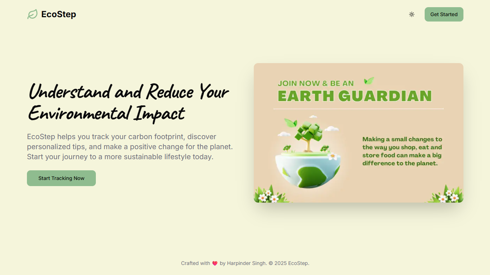

# EcoStep: Understand and Reduce Your Environmental Impact

  

**EcoStep** is a modern, AI-powered web application designed to help environmentally conscious individuals understand, track, and reduce their carbon footprint. By logging daily activities across various categories, users gain valuable insights into their environmental impact through rich visualizations and personalized, actionable recommendations.

## ✨ Features In-Depth

EcoStep is packed with features to make sustainability engaging, data-driven, and achievable.

### 1. 📊 Interactive Dashboard
The dashboard is the user's central hub, providing a comprehensive overview at a glance.
- **Impact Summary Cards:** Key metrics like "Today's Footprint," "Weekly Footprint," and potential CO2e savings are displayed prominently.
- **Gamification Status:** Tracks user level, XP progress, and their current daily login streak.
- **Impact Charts:**
  - **Overview Chart:** A bar chart breaking down the estimated monthly footprint by category.
  - **Progress Chart:** A line chart showing the user's total footprint over time, visualizing their progress.
- **Milestones & Challenges:** Displays unlocked achievements and active community challenges the user has joined.
- **Daily Quote:** An AI-generated inspirational quote to keep users motivated.

### 2. ✍️ Activity & Impact Logging
The core of the app, allowing users to quantify their daily habits.
- **Categorized Logging:** Users can log data across five key areas: Transportation, Energy, Waste, Water, and Food.
- **Intuitive Forms:** Uses sliders, radio buttons, and clear inputs to make data entry fast and easy.
- **Dynamic Calculations:** The app instantly calculates the CO2e (carbon dioxide equivalent) for each entry, providing immediate feedback.

### 3. 🤖 AI-Powered Toolkit (Powered by Genkit & Gemini)
A suite of intelligent tools to guide users on their sustainability journey.
- **Personalized Eco-Tips:** The AI analyzes a user's latest activity log and generates custom-tailored tips.
- **AI Product Analyzer:** Users can enter a product name or upload a photo, and the AI will provide an eco-friendliness score, a summary, pros, cons, and sustainable alternatives.
- **Eco-Recipe Generator:** Users can specify dietary needs and available ingredients to generate unique, low-impact recipes.
- **Learn Section:** An educational corner with AI-generated articles on key environmental topics.
- **Local Recommendations:** Get sustainability tips tailored to your country.

### 4. 🌱 Eco Actions
Discover a curated list of impactful, AI-recommended actions you can take to make a difference. Set personal goals for actions or mark them as complete to track your real-world progress.

### 5. 🌍 Community Hub & Gamification
Features designed to make sustainability a collaborative and rewarding experience.
- **Gamification Engine:**
  - **XP & Levels:** Earn experience points for logging activities to level up.
  - **Daily Streaks:** Stay motivated by logging consistently.
  - **Milestones:** Unlock achievements for reaching key goals.
- **Community Hub:**
  - **Global Leaderboard:** A public leaderboard ranking the top "Earth Guardians" by their total XP.
  - **Community Challenges:** Users can join collective goals to make a bigger impact together.

### 6. 👤 Personalized Experience
- **Guided Onboarding:** A multi-step questionnaire establishes a baseline carbon footprint for new users.
- **Profile Management:** Users can update their display name, country, and choose from a selection of fun "Eco-Avatars".

### 7. 🎨 Modern UI & UX
A clean, modern, and user-friendly interface.
- **Responsive Design:** A mobile-first layout that works beautifully on all devices.
- **Dark/Light Mode:** A theme toggle allows users to choose their preferred mode for optimal readability.

## 🛠️ Tech Stack

This project is built with a modern, robust, and scalable tech stack:

- **Framework:** [Next.js](https://nextjs.org/) (App Router)
- **Language:** [TypeScript](https://www.typescriptlang.org/)
- **Styling:** [Tailwind CSS](https://tailwindcss.com/)
- **UI Components:** [ShadCN UI](https://ui.shadcn.com/)
- **AI Integration:** [Genkit](https://firebase.google.com/docs/genkit) (with Google's Gemini models)
- **Backend & Database:** [Firebase](https://firebase.google.com/) (Authentication & Firestore)
- **Data Visualization:** [Recharts](https://recharts.org/)
- **Form Management:** [React Hook Form](https://react-hook-form.com/) & [Zod](https://zod.dev/) for schema validation.

---
*Crafted with ❤️ by Harpinder Singh.*